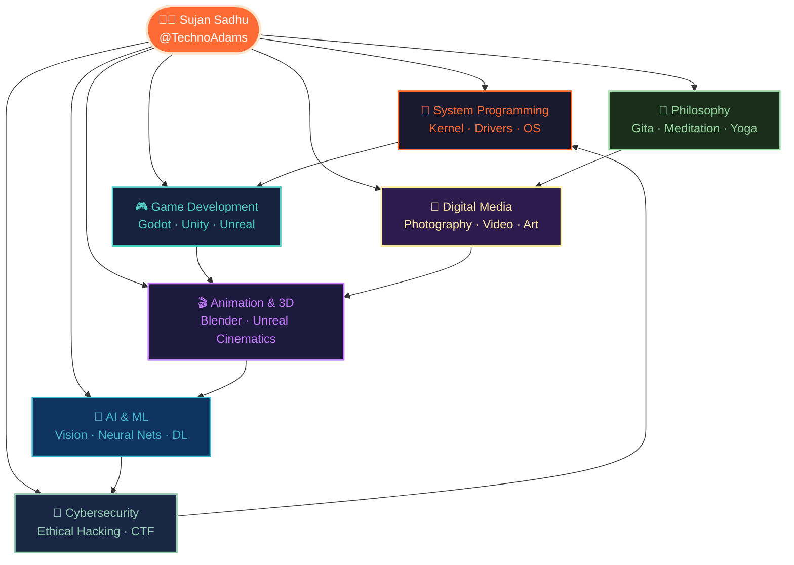

<div align="center">

<!-- ═══════════════════════════════════════════════════════════ -->
<!--                     EPIC HEADER BANNER                    -->
<!-- ═══════════════════════════════════════════════════════════ -->


<div align="center">


</div>
<br/>

[](https://github.com/TechnoAdams)
[](https://github.com/TechnoAdams)
[](https://github.com/TechnoAdams)

</div>

---

<table>
  <tr>
    <td>

<h3>🚀 Hey there, I'm <strong>@TechnoAdams</strong>!</h3>

I'm Sujan Sadhu, a dedicated tech innovator driven by curiosity and the desire to build meaningful solutions. I love diving deep into system-level programming, crafting immersive gaming experiences, and exploring the endless possibilities of technology.

<blockquote>
  Currently mastering <strong>Kernel & OS Development</strong> – Understanding systems from the ground up<br>
  Building with <strong>Game Engines</strong> – Creating interactive digital worlds<br>
  System Architect | Tech Innovator | Digital Creator
</blockquote>

</td>
<td align="right" style="vertical-align: top;">
  
</td>
  </tr>
</table>

```ascii
    ╭─────────────────────────────────────────────────────────────────╮
    │  "Code with purpose, innovate with passion, build with vision"   │
    │  Creating solutions that matter                                  │
    ╰─────────────────────────────────────────────────────────────────╯
```

<br/>

<div align="center">

</div>

---


## 🎯 Core Focus Areas

<div align="center">

| 🖥️ **System Engineering** | 🎮 **Interactive Media** | 🤖 **Intelligence Systems** | 🎨 **Digital Creation** |
|:---:|:---:|:---:|:---:|
| **Kernel Architecture** | **Engine Development** | **Machine Learning** | **Content Production** |
| Low-level optimization | Unity & Unreal mastery | Computer Vision | Photography & Video |
| Hardware interfacing | Graphics programming | Neural networks | Creative Suite workflows |

</div>

---


<div align="center">


<br/><br/>

### 🔤 Programming Languages

<p>

</p>

<br/>

### 🎮 Game Development

<p>

</p>

<br/>

### 🎬 Animation & 3D Development

<p>

</p>

<br/>

### 🛠️ Tools & Platforms

<p>

</p>

<br/>

### 🤖 Currently Exploring

<p>

</p>

</div>


## 📊 Development Analytics

<p align="center">
  
  
  <br>
  
</p>

<div align="center">

[](https://github.com/TechnoAdams)

</div>

---

## 🎯 Active Projects

<table>
<tr>
<td width="50%">

### 🖥️ **System-Level Innovation**
```bash
# Building custom kernel components
$ gcc -O2 -Wall system_driver.c
$ insmod tech_module.ko
$ dmesg | grep "Innovation"
$ ./benchmark_performance
```
> **Mission**: Developing efficient systems, performance optimization, and deep hardware-software integration.

</td>
<td width="50%">

### 🎮 **Next-Gen Gaming**
```cpp
class InnovativeEngine {
public:
    RenderSystem* graphics;
    PhysicsEngine* dynamics;
    AudioManager* sound;
    
    void launch() {
        initializeGraphics();
        setupPhysics();
        loadGameWorld();
    }
};
```
> **Goal**: Building immersive experiences through cutting-edge engines and creative gameplay systems.

</td>
</tr>
</table>

---

### ⚡ Personal Insights
Beyond the screen, I find balance through Gita study, meditation practices, and the peaceful rhythm of yoga and bhajans.  
My curiosity drives me to constantly explore emerging technologies and contribute to the developer community.

---

## 🎯 Expertise Network

<div align="center">


```mermaid
graph TD
    Sujan(["👨‍💻 Sujan Sadhu\n@TechnoAdams"]):::center

    System["🔧 System Programming\nKernel · Drivers · OS"]:::core
    Gaming["🎮 Game Development\nGodot · Unity · Unreal"]:::tech
    Animation["🎬 Animation & 3D\nBlender · Unreal Cinematics"]:::anim
    AI["🤖 AI & ML\nVision · Neural Nets · DL"]:::ml
    Security["🔐 Cybersecurity\nEthical Hacking · CTF"]:::security
    Creative["🎨 Digital Media\nPhotography · Video · Art"]:::creative
    Spiritual["🧘 Philosophy\nGita · Meditation · Yoga"]:::spirit

    Sujan --> System
    Sujan --> Gaming
    Sujan --> Animation
    Sujan --> AI
    Sujan --> Security
    Sujan --> Creative
    Sujan --> Spiritual

    System --> Gaming
    Gaming --> Animation
    Animation --> AI
    AI --> Security
    Security --> System
    Creative --> Animation
    Spiritual --> Creative

    classDef center fill:#FF6B35,stroke:#FFE4CC,color:#fff,stroke-width:3px
    classDef core fill:#1a1a2e,stroke:#FF6B35,color:#FF6B35,stroke-width:2px
    classDef tech fill:#16213e,stroke:#4ECDC4,color:#4ECDC4,stroke-width:2px
    classDef anim fill:#1e1a3e,stroke:#C77DFF,color:#C77DFF,stroke-width:2px
    classDef ml fill:#0f3460,stroke:#45B7D1,color:#45B7D1,stroke-width:2px
    classDef security fill:#1a2744,stroke:#96CEB4,color:#96CEB4,stroke-width:2px
    classDef creative fill:#2d1b4e,stroke:#FFEAA7,color:#FFEAA7,stroke-width:2px
    classDef spirit fill:#1b2e1b,stroke:#98D8A0,color:#98D8A0,stroke-width:2px
```

</div>

##  &nbsp; Life Beyond the Screen

<br/>

<div align="center">

</div>

<br/>

<table width="100%">
<tr>
<td align="center" width="33%">


**🧘 Spiritual Journey**

Bhagavad Gita Reflection
Daily Meditation & Pranayama
Yoga & Mindfulness
Bhajan & Katha Sessions
Inner Peace as Foundation

</td>
<td align="center" width="33%">


**📸 Creative Expression**

Photography Adventures
Video Content Creation
Digital Storytelling
Visual Art & Motion Graphics
Adobe Creative Suite

</td>
<td align="center" width="33%">


**🌱 Continuous Growth**

Next-Gen Tech Exploration
Open Source Contributions
Community Collaboration
Knowledge Sharing & Mentoring
Competitive Programming

</td>
</tr>
</table>

---

##  &nbsp; Connect & Collaborate

<br/>

<div align="center">


<br/><br/>

[](https://www.linkedin.com/in/sujan-sadhu/)
[](https://x.com/SSadhu99006)
[](https://www.instagram.com/_sujansadhu_/)
[](https://github.com/TechnoAdams)
[](mailto:studysadhu2022@gmail.com)

<br/><br/>

> 💡 **Open to**: Collaborations &nbsp;•&nbsp; Open Source &nbsp;•&nbsp; Research Projects &nbsp;•&nbsp; Game Jams &nbsp;•&nbsp; Hackathons

<br/>


</div>

---

<div align="center">


<br/><br/>

```
  ╔══════════════════════════════════════════════════════╗
  ║   "Build systems that inspire and serve humanity"   ║
  ║        Technology with a human heart  ❤️             ║
  ║        Where Innovation Meets Purpose  🌟            ║
  ╚══════════════════════════════════════════════════════╝
```

<br/>


</div>
