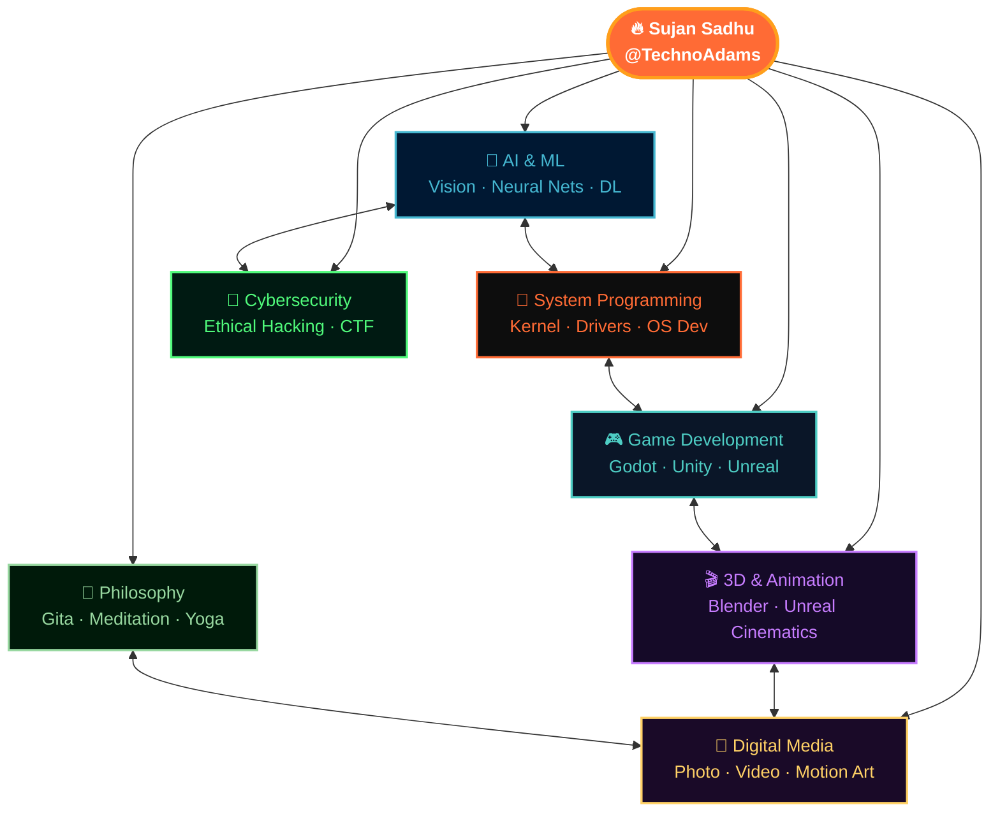

<div align="center">


<br/>


<br/><br/>

<a href="https://github.com/TechnoAdams"></a>
<a href="https://github.com/TechnoAdams?tab=followers"></a>
<a href="https://github.com/TechnoAdams?tab=stars"></a>


</div>

---


## 🚀 Hey there, I'm **@TechnoAdams** — Sujan Sadhu

A dedicated tech innovator fueled by curiosity and a relentless drive to build things that matter. I architect systems from the ground up, craft immersive gaming experiences, and push the boundaries of what technology can achieve.

```bash
$ whoami
> Sujan Sadhu — @TechnoAdams

$ cat current_mission.txt
> 🖥️  Mastering Kernel & OS Development
> 🎮  Building Next-Gen Game Engines  
> 🤖  Exploring AI & Computer Vision
> 🧘  Coding with a Spiritual Foundation

$ ./run_passion --mode=infinite
> Innovation loop started... ∞
```

> *"Code with purpose, innovate with passion, build with vision — technology with a human heart."*

<br clear="right"/>

---

<div align="center">

</div>

---

## 🎯 Core Focus Areas

<div align="center">

<table>
<tr>
<td align="center" width="22%">
<br/>
<b>🖥️ System Engineering</b><br/>
<sub>Kernel Architecture • Low-level Optimization • Hardware Interfacing • Driver Development</sub>
</td>
<td align="center" width="22%">
<br/>
<b>🎮 Game Development</b><br/>
<sub>Engine Architecture • Graphics Programming • Physics Systems • Gameplay Mechanics</sub>
</td>
<td align="center" width="22%">
<br/>
<b>🤖 AI & Intelligence</b><br/>
<sub>Machine Learning • Computer Vision • Neural Networks • Deep Learning</sub>
</td>
<td align="center" width="22%">
<br/>
<b>🎨 Digital Creation</b><br/>
<sub>Photography • Videography • Motion Graphics • Adobe Creative Suite</sub>
</td>
</tr>
</table>

</div>

---

## 🛠️ Technology Arsenal

<div align="center">

### 🔤 Programming Languages


<br/>

### 🎮 Game Development Ecosystem


<br/>

### 🎬 3D & Animation


<br/>

### 🛠️ Dev Tools & Platforms


<br/>

### 🤖 AI / ML — Currently Exploring


</div>

---

## 📊 GitHub Analytics

<div align="center">


&nbsp;&nbsp;


<br/><br/>


<br/><br/>

[](https://github.com/TechnoAdams)

</div>

---

## 🔥 Active Projects

<div align="center">

<table>
<tr>
<td width="50%" valign="top">

### 🖥️ System-Level Innovation

```bash
# Custom kernel module development
$ gcc -O3 -Wall -Wextra kernel_mod.c
$ sudo insmod techno_driver.ko
$ dmesg | grep "[TechnoAdams]"
[  2.314] TechnoAdams: Module initialized ✓
[  2.315] TechnoAdams: Hardware handshake OK
[  2.316] TechnoAdams: Performance mode: BEAST

$ ./run_benchmark --iterations=1M
> Throughput: 2.4 GB/s  ⚡ Optimal
```

**Mission**: Efficient systems, extreme performance optimization, and deep hardware-software integration.

</td>
<td width="50%" valign="top">

### 🎮 Next-Gen Game Engine

```cpp
class TechnoEngine {
  RenderPipeline* vulkanRenderer;
  PhysicsWorld*   bulletDynamics;
  AudioMixer*     spatialSound;
  AIDirector*     npcBehaviour;
public:
  void ignite() {
    vulkanRenderer->init(RTX_MODE);
    bulletDynamics->setupWorld();
    npcBehaviour->loadNeuralNet();
    // Game world: online ✓
  }
};
// Building dreams, one frame at a time 🎮
```

**Goal**: Immersive experiences through cutting-edge engine architecture and creative gameplay.

</td>
</tr>
</table>

</div>

---

## 🌐 Expertise Network

<div align="center">


```mermaid
graph TD
    Sujan(["🔥 Sujan Sadhu\n@TechnoAdams"]):::center

    System["🔧 System Programming\nKernel · Drivers · OS Dev"]:::core
    Gaming["🎮 Game Development\nGodot · Unity · Unreal"]:::tech
    Animation["🎬 3D & Animation\nBlender · Unreal Cinematics"]:::anim
    AI["🤖 AI & ML\nVision · Neural Nets · DL"]:::ml
    Security["🔐 Cybersecurity\nEthical Hacking · CTF"]:::security
    Creative["🎨 Digital Media\nPhoto · Video · Motion Art"]:::creative
    Spiritual["🧘 Philosophy\nGita · Meditation · Yoga"]:::spirit

    Sujan --> System
    Sujan --> Gaming
    Sujan --> Animation
    Sujan --> AI
    Sujan --> Security
    Sujan --> Creative
    Sujan --> Spiritual

    System <--> Gaming
    Gaming <--> Animation
    Animation <--> Creative
    AI <--> Security
    AI <--> System
    Spiritual <--> Creative

    classDef center fill:#FF6B35,stroke:#FF9F1C,color:#fff,stroke-width:3px,font-weight:bold
    classDef core fill:#0d0d0d,stroke:#FF6B35,color:#FF6B35,stroke-width:2px
    classDef tech fill:#0a1628,stroke:#4ECDC4,color:#4ECDC4,stroke-width:2px
    classDef anim fill:#150a28,stroke:#C77DFF,color:#C77DFF,stroke-width:2px
    classDef ml fill:#001833,stroke:#45B7D1,color:#45B7D1,stroke-width:2px
    classDef security fill:#001a12,stroke:#50FA7B,color:#50FA7B,stroke-width:2px
    classDef creative fill:#1a0a28,stroke:#FFD166,color:#FFD166,stroke-width:2px
    classDef spirit fill:#001a0a,stroke:#98D8A0,color:#98D8A0,stroke-width:2px
```

</div>

---

## 🧘 Life Beyond the Screen

<div align="center">

</div>

<br/>

<div align="center">
<table>
<tr>
<td align="center" width="33%">
<br/><br/>
<b>🧘 Spiritual Foundation</b><br/><br/>
Bhagavad Gita Reflection<br/>
Daily Meditation & Pranayama<br/>
Yoga & Mindfulness Practice<br/>
Bhajan & Katha Sessions<br/>
<i>Inner peace as the root of innovation</i>
</td>
<td align="center" width="33%">
<br/><br/>
<b>📸 Creative Expression</b><br/><br/>
Photography Adventures<br/>
Video Content Creation<br/>
Digital Storytelling<br/>
Motion Graphics & Visual Art<br/>
<i>Adobe Creative Suite workflows</i>
</td>
<td align="center" width="33%">
<br/><br/>
<b>🌱 Continuous Growth</b><br/><br/>
Next-Gen Tech Exploration<br/>
Open Source Contributions<br/>
Community Collaboration<br/>
Knowledge Sharing & Mentoring<br/>
<i>Competitive programming & hackathons</i>
</td>
</tr>
</table>
</div>

---

## 🤝 Connect & Collaborate

<div align="center">


<br/><br/>

[](https://www.linkedin.com/in/sujan-sadhu/)
[](https://x.com/SSadhu99006)
[](https://www.instagram.com/_sujansadhu_/)
[](https://github.com/TechnoAdams)
[](mailto:studysadhu2022@gmail.com)

<br/><br/>

> 💡 **Open to**: Collaborations &nbsp;•&nbsp; Open Source &nbsp;•&nbsp; Research Projects &nbsp;•&nbsp; Game Jams &nbsp;•&nbsp; Hackathons &nbsp;•&nbsp; Mentorship

<br/>


</div>

---

<div align="center">


<br/><br/>

```
  ╔══════════════════════════════════════════════════════════╗
  ║    "Build systems that inspire and serve humanity"      ║
  ║         Technology with a human heart  ❤️               ║
  ║         Where Innovation Meets Purpose  🌟              ║
  ║              @TechnoAdams — Est. 2024                   ║
  ╚══════════════════════════════════════════════════════════╝
```

<br/>


</div>
