<div align="center">

# 🌟 Sujan Sadhu

### `Innovation Through Code • Excellence Through Practice • Impact Through Technology`

</div>

---

<p align="center">
  
</p>

---

<table>
  <tr>
    <td>

<h3>🚀 Hey there, I'm <strong>@TechnoAdams</strong>!</h3>

I'm Sujan Sadhu, a dedicated tech innovator driven by curiosity and the desire to build meaningful solutions. I love diving deep into system-level programming, crafting immersive gaming experiences, and exploring the endless possibilities of technology.

<blockquote>
  Currently mastering <strong>Kernel & OS Development</strong> – Understanding systems from the ground up<br>
  Building with <strong>Game Engines</strong> – Creating interactive digital worlds<br>
  System Architect | Tech Innovator | Digital Creator
</blockquote>

</td>
<td align="right" style="vertical-align: top;">
  
</td>
  </tr>
</table>

```ascii
    ╭─────────────────────────────────────────────────────────────────╮
    │  "Code with purpose, innovate with passion, build with vision"   │
    │  Creating solutions that matter                                  │
    ╰─────────────────────────────────────────────────────────────────╯
```

<details>
<summary>🧠 <b>My Development Philosophy</b></summary>

```python
class SujanSadhu:
    def __init__(self):
        self.name = "Sujan Sadhu"
        self.role = "System Architect & Innovation Engineer"
        self.core_belief = "Technology + Creativity = Transformation"
        self.expertise = ["System Programming", "Game Development", "AI Integration"]
        
    def life_balance(self):
        return {
            "dawn": "Meditation & Spiritual Reading",
            "day": "Build, Code, Innovate",
            "evening": "Reflection & Learning",
            "night": "Exploring Next-Gen Tech"
        }
    
    def mission_statement(self):
        return "Craft code with purpose, build systems with vision, innovate for impact"
```

</details>

---

## 🎯 Core Focus Areas

<div align="center">

| 🖥️ **System Engineering** | 🎮 **Interactive Media** | 🤖 **Intelligence Systems** | 🎨 **Digital Creation** |
|:---:|:---:|:---:|:---:|
| **Kernel Architecture** | **Engine Development** | **Machine Learning** | **Content Production** |
| Low-level optimization | Unity & Unreal mastery | Computer Vision | Photography & Video |
| Hardware interfacing | Graphics programming | Neural networks | Creative Suite workflows |

</div>

---

## 💻 Technical Stack

<div align="center">

### ⚙️ Technologies & Tools

<p align="center">
  <a href="https://skillicons.dev">
    
  </a>
</p>

</div>

---

## 📊 Development Analytics

<p align="center">
  
  
  <br>
  
</p>

<div align="center">

[](https://github.com/TechnoAdams)

</div>

---

## 🎯 Active Projects

<table>
<tr>
<td width="50%">

### 🖥️ **System-Level Innovation**
```bash
# Building custom kernel components
$ gcc -O2 -Wall system_driver.c
$ insmod tech_module.ko
$ dmesg | grep "Innovation"
$ ./benchmark_performance
```
> **Mission**: Developing efficient systems, performance optimization, and deep hardware-software integration.

</td>
<td width="50%">

### 🎮 **Next-Gen Gaming**
```cpp
class InnovativeEngine {
public:
    RenderSystem* graphics;
    PhysicsEngine* dynamics;
    AudioManager* sound;
    
    void launch() {
        initializeGraphics();
        setupPhysics();
        loadGameWorld();
    }
};
```
> **Goal**: Building immersive experiences through cutting-edge engines and creative gameplay systems.

</td>
</tr>
</table>

---

### ⚡ Personal Insights
Beyond the screen, I find balance through Gita study, meditation practices, and the peaceful rhythm of yoga and bhajans.  
My curiosity drives me to constantly explore emerging technologies and contribute to the developer community.

---

## 🎯 Expertise Network

```mermaid
graph TD
    System["🔧<br><b>System Programming</b><br><sub>⚙️ Kernel Dev, Optimization</sub>"]:::core
    Gaming["🎮<br><b>Game Development</b><br><sub>🎲 Engines, Graphics, Physics</sub>"]:::tech
    Intelligence["🤖<br><b>AI & ML</b><br><sub>🧠 Vision, Neural Networks</sub>"]:::ml
    Security["🔐<br><b>Security</b><br><sub>🛡️ Ethical Testing, Analysis</sub>"]:::security
    Creative["🎨<br><b>Digital Media</b><br><sub>🎭 Photography, Video, Art</sub>"]:::creative

    %% Circular connections
    System --> Gaming
    Gaming --> Intelligence
    Intelligence --> Security
    Security --> Creative
    Creative --> System

    %% Cross-links
    System --> Intelligence
    Gaming --> Creative
    Security --> Gaming
    Creative --> Intelligence

    %% Styles
    classDef core fill:#FF6B35,stroke:#1a1a1a,color:#fff,stroke-width:2px
    classDef tech fill:#4ECDC4,stroke:#1a1a1a,color:#fff,stroke-width:2px
    classDef ml fill:#45B7D1,stroke:#1a1a1a,color:#fff,stroke-width:2px
    classDef security fill:#96CEB4,stroke:#1a1a1a,color:#000,stroke-width:2px
    classDef creative fill:#FFEAA7,stroke:#1a1a1a,color:#000,stroke-width:2px
```

<div align="center">



</div>

---

## 🤝 Connect & Collaborate

<p align="center">
  <a href="https://www.instagram.com/_sujansadhu_/">
    
  </a>
  <a href="https://github.com/TechnoAdams">
    
  </a>
  <a href="mailto:studysadhu2022@gmail.com">
    
  </a>
</p>

<p align="center">
  
  
  
</p>

---

## 🎭 Life Beyond Code

<div align="center">

| 🧘‍♂️ **Spiritual Journey** | 📸 **Creative Expression** | 🌱 **Growth Mindset** |
|:---:|:---:|:---:|
| Bhagavad Gita Reflection | Photography Adventures | Cutting-edge Tech Exploration |
| Daily Meditation | Video Content Creation | Open Source Contributions |
| Yoga & Mindfulness | Digital Storytelling | Community Collaboration |
| Bhajan & Katha Sessions | Visual Art Projects | Knowledge Sharing |

</div>

### 🌟 "Where Innovation Meets Purpose" 🌟

```
             ╭─────────────────────────────────────────╮
             │  "Build systems that inspire and serve" │
             │  Technology with a human heart          │
             ╰─────────────────────────────────────────╯
```

---

<p align="center">
  
</p>

<p align="center">
  
</p>

<p align="center">
  <a href="https://github.com/TechnoAdams">
    
  </a>
</p>

<p align="center">
  <a href="https://github.com/TechnoAdams">
    
  </a>
</p>

---
