<div align="center">

# 🌟 Sujan Sadhu

### `Code with Dedication, Create with Mastery, Deliver with Excellence`

</div>

---

<p align="center">
  
</p>

---

<table>
  <tr>
    <td>

<h3>🚀 Hi, I'm <strong>@TechnoAdams</strong>!</h3>

I'm Sujan Sadhu, a passionate tech enthusiast driven by curiosity and innovation. I constantly explore new technologies, challenge myself with groundbreaking projects, and actively contribute to the tech community.

<blockquote>
  Currently exploring <strong>Kernel & OS Development</strong> – Diving deep into system architecture<br>
  Experimenting with <strong>Game Engines</strong> – Building immersive experiences<br>
  Tech Enthusiast | System Architect | Creative Developer
</blockquote>

</td>
<td align="right" style="vertical-align: top;">
  
</td>
  </tr>
</table>

```ascii
    ╭─────────────────────────────────────────────────────────────────╮
    │  "Innovation distinguishes between a leader and a follower"      │
    │  Focus on building, not just coding                              │
    ╰─────────────────────────────────────────────────────────────────╯
```

<details>
<summary>🧠 <b>Philosophy Behind My Code</b></summary>

```python
class SujanSadhu:
    def __init__(self):
        self.name = "Sujan Sadhu"
        self.role = "Tech Innovator & System Architect"
        self.life_philosophy = "Code + Creativity = Innovation"
        self.current_focus = ["Kernel Development", "Game Engines", "AI Systems"]
        
    def daily_routine(self):
        return {
            "morning": "Meditation & Gita Reading",
            "day": "Code, Build, Innovate",
            "evening": "Bhajans & Reflection",
            "night": "Exploring New Tech"
        }
    
    def get_motto(self):
        return "Build for purpose, code for humanity, innovate for impact"
```

</details>

---

## 🎯 Current Focus Areas

<div align="center">

| 🖥️ **System Programming** | 🎮 **Game Development** | 🤖 **AI & Intelligence** | 🎨 **Creative Tech** |
|:---:|:---:|:---:|:---:|
| **Kernel Development** | **Engine Architecture** | **Machine Learning** | **Digital Content** |
| OS-level programming | Unity & Unreal projects | Computer Vision | Photography & Video |
| Performance optimization | Graphics programming | Neural networks | Adobe Creative Suite |

</div>

---

## 💻 Technical Expertise

<div align="center">

### ⚙️ Skills & Abilities

<p align="center">
  <a href="https://skillicons.dev">
    
  </a>
</p>

</div>

---

## 📊 GitHub Analytics

<p align="center">
  
  
  <br>
  
</p>

<div align="center">

[](https://github.com/TechnoAdams)

</div>

---

## 🎯 Current Missions

<table>
<tr>
<td width="50%">

### 🖥️ **System Architecture**
```bash
# Exploring low-level programming
$ gcc -O3 -Wall kernel_module.c
$ insmod custom_driver.ko
$ dmesg | tail
$ ./performance_test
```
> **Focus**: Building efficient systems, optimizing performance, and understanding hardware-software interaction.

</td>
<td width="50%">

### 🎮 **Game Engine Development**
```cpp
class GameEngine {
public:
    Renderer* renderer;
    Physics* physics;
    Audio* audio;
    
    void initialize() {
        setupGraphics();
        initPhysics();
        loadAssets();
    }
};
```
> **Vision**: Creating immersive experiences through custom engines and innovative gameplay mechanics.

</td>
</tr>
</table>

---

### ⚡ Fun Facts
When I'm not coding, you'll find me reading the Gita, or relaxing with meditation, yoga, and listening to bhajans or kathas.  
I have a passion for exploring new technology, always eager to dive into the latest innovations.

---

## 🎯 Areas of Expertise

```mermaid
graph TD
    OS["🔧<br><b>Kernel & OS Dev</b><br><sub>⚙️ System Architecture, Optimization</sub>"]:::core
    Game["🎮<br><b>Game Engines</b><br><sub>🎲 Graphics, Physics, Rendering</sub>"]:::tech
    AI["🤖<br><b>AI & ML</b><br><sub>🧠 Computer Vision, Neural Networks</sub>"]:::ml
    Security["🔐<br><b>Cybersecurity</b><br><sub>🛡️ Ethical Hacking, Penetration Testing</sub>"]:::security
    Creative["🎨<br><b>Creative Media</b><br><sub>🎭 Photography, Video, Digital Art</sub>"]:::creative

    %% Circular connections
    OS --> Game
    Game --> AI
    AI --> Security
    Security --> Creative
    Creative --> OS

    %% Cross-links
    OS --> AI
    Game --> Creative
    Security --> Game
    Creative --> AI

    %% Styles
    classDef core fill:#F94144,stroke:#1a1a1a,color:#fff,stroke-width:2px
    classDef tech fill:#43AA8B,stroke:#1a1a1a,color:#fff,stroke-width:2px
    classDef ml fill:#577590,stroke:#1a1a1a,color:#fff,stroke-width:2px
    classDef security fill:#F8961E,stroke:#1a1a1a,color:#fff,stroke-width:2px
    classDef creative fill:#F9C74F,stroke:#1a1a1a,color:#000,stroke-width:2px
```

<div align="center">



</div>

---

## 🤝 Connect & Collaborate

<p align="center">
  <a href="https://www.instagram.com/_sujansadhu_/">
    
  </a>
  <a href="https://github.com/TechnoAdams">
    
  </a>
  <a href="mailto:studysadhu2022@gmail.com">
    
  </a>
</p>

<p align="center">
  
  
  
</p>

---

## 🎭 Beyond the Code

<div align="center">

| 🧘‍♂️ **Spiritual Practices** | 📸 **Creative Pursuits** | 🌱 **Learning Journey** |
|:---:|:---:|:---:|
| Bhagavad Gita Study | Photography & Cinematography | Exploring Bleeding-edge Tech |
| Daily Meditation | Digital Editing | Open Source Contributions |
| Yoga & Mindfulness | Creative Content | Community Building |
| Bhajan Listening | Visual Storytelling | Knowledge Sharing |

</div>

### 🌟 "Where Technology Meets Innovation" 🌟

```
             ╭─────────────────────────────────────────╮
             │  "Build for impact, code for humanity"  │
             │  Innovation through dedication          │
             ╰─────────────────────────────────────────╯
```

---

<p align="center">
  
</p>

<p align="center">
  
</p>

<p align="center">
  <a href="https://github.com/TechnoAdams">
    
  </a>
</p>

<p align="center">
  <a href="https://github.com/TechnoAdams">
    
  </a>
</p>

---
