<div align="center">

# 🌟 Sujan Sadhu
### `System Architect • Innovation Engineer • Digital Visionary`


</div>

---

<p align="center">
  
</p>

---

<div align="center">

### ⚡ POWER METRICS ⚡

<table>
<tr>
<td align="center">

<br>
<sub><b>🕐 Experience</b></sub>
</td>
<td align="center">

<br>
<sub><b>🚀 Innovation</b></sub>
</td>
<td align="center">

<br>
<sub><b>⌨️ Craftsmanship</b></sub>
</td>
<td align="center">

<br>
<sub><b>☕ Fuel</b></sub>
</td>
</tr>
</table>

</div>

---

<table>
  <tr>
    <td width="50%">

<h3>🌟 <strong>Digital Architect & System Innovator</strong></h3>

I'm **Sujan Sadhu** (@TechnoAdams), a passionate technologist who transforms complex problems into elegant solutions. My journey spans from low-level kernel development to immersive gaming experiences, always pushing the boundaries of what's possible.

<div align="center">

```ascii
╔═══════════════════════════════════════════════════╗
║  🎯 Mission: Build systems that inspire and serve ║
║  ⚡ Vision: Technology with purpose and impact    ║
║  🚀 Goal: Innovation through elegant code         ║
╚═══════════════════════════════════════════════════╝
```

</div>

**Current Focus:**
- 🖥️ **Advanced Kernel Development** – Deep system programming
- 🎮 **Next-Gen Game Engines** – Immersive digital worlds  
- 🤖 **AI-Powered Solutions** – Intelligence meets creativity
- 🔧 **Performance Optimization** – Making impossible possible

</td>
<td align="center" width="50%">
  
  
  <br><br>
  
  
  
</td>
  </tr>
</table>

---

## 🔥 POWER STACK 🔥

<div align="center">

### 💻 **Core Technologies**

<p align="center">
  
</p>

### 🛠️ **Development Arsenal**

<p align="center">
  
</p>

### 🎮 **Game Development & Graphics**

<p align="center">
  
</p>

### 🎨 **Creative Suite**

<p align="center">
  
</p>

### 🌐 **Web Technologies**

<p align="center">
  
</p>

</div>

---

## 📊 PERFORMANCE ANALYTICS

<div align="center">

<table>
<tr>
<td width="50%">

</td>
<td width="50%">

</td>
</tr>
</table>


<br><br>


</div>

---

## 🚀 ACTIVE PROJECTS & INNOVATIONS

<table>
<tr>
<td width="33%">

<div align="center">

### 🖥️ **QUANTUM KERNEL**


```c
// High-performance kernel module
typedef struct quantum_scheduler {
    task_queue_t *ready_queue;
    atomic_t task_count;
    spinlock_t queue_lock;
} quantum_sched_t;

int quantum_schedule(void) {
    return optimize_performance();
}
```

**Features:**
- ⚡ Ultra-low latency scheduling
- 🔒 Advanced security primitives  
- 🚀 Hardware acceleration
- 📊 Real-time monitoring

</div>

</td>
<td width="33%">

<div align="center">

### 🎮 **NEXUS ENGINE**


```cpp
class NexusEngine {
private:
    RenderPipeline* graphics;
    PhysicsWorld* physics;
    AudioSystem* audio;
    
public:
    void initialize() {
        setupAdvancedGraphics();
        enableRayTracing();
        loadGameWorld();
    }
};
```

**Capabilities:**
- 🌟 Ray-traced lighting
- ⚡ 120+ FPS optimization
- 🎯 AI-driven NPCs
- 🌍 Procedural worlds

</div>

</td>
<td width="33%">

<div align="center">

### 🤖 **CORTEX AI**


```python
class CortexAI:
    def __init__(self):
        self.neural_net = DeepNetwork()
        self.vision_module = CVPipeline()
        self.reasoning = LogicEngine()
    
    def think(self, input_data):
        return self.process_intelligence(
            input_data
        )
```

**Features:**
- 🧠 Deep neural networks
- 👁️ Computer vision
- 💭 Natural reasoning
- 🔮 Predictive analysis

</div>

</td>
</tr>
</table>

---

## 🎯 EXPERTISE MATRIX

```mermaid
graph TB
    Core["🔧 SYSTEM CORE<br/>Kernel Development<br/>Performance Optimization<br/>Hardware Integration"]:::core
    
    Gaming["🎮 GAME ENGINE<br/>Graphics Programming<br/>Physics Simulation<br/>Audio Processing"]:::gaming
    
    AI["🤖 INTELLIGENCE<br/>Machine Learning<br/>Computer Vision<br/>Neural Networks"]:::ai
    
    Security["🔐 SECURITY<br/>Ethical Hacking<br/>Vulnerability Analysis<br/>System Hardening"]:::security
    
    Creative["🎨 CREATIVE TECH<br/>Digital Art<br/>Video Production<br/>Interactive Media"]:::creative
    
    Web["🌐 WEB SYSTEMS<br/>Full-Stack Development<br/>Cloud Architecture<br/>DevOps Pipeline"]:::web

    Core --> Gaming
    Gaming --> AI
    AI --> Security
    Security --> Creative
    Creative --> Web
    Web --> Core
    
    Core --> AI
    Gaming --> Security
    AI --> Creative
    Security --> Web
    Creative --> Core
    Web --> Gaming

    classDef core fill:#FF6B35,stroke:#00D9FF,stroke-width:3px,color:#fff
    classDef gaming fill:#4ECDC4,stroke:#FF6B35,stroke-width:3px,color:#000
    classDef ai fill:#00D9FF,stroke:#4ECDC4,stroke-width:3px,color:#000
    classDef security fill:#96CEB4,stroke:#00D9FF,stroke-width:3px,color:#000
    classDef creative fill:#FFEAA7,stroke:#96CEB4,stroke-width:3px,color:#000
    classDef web fill:#DDA0DD,stroke:#FFEAA7,stroke-width:3px,color:#000
```

<div align="center">



</div>

---

## 🏆 ACHIEVEMENTS & RECOGNITION

<div align="center">

<table>
<tr>
<td align="center">

</td>
</tr>
</table>

### 🎖️ **Hall of Fame**

| 🥇 **Gold Tier** | 🥈 **Silver Tier** | 🥉 **Bronze Tier** |
|:---:|:---:|:---:|
| **System Architect** | **Game Developer** | **AI Researcher** |
| 5+ years experience | 3+ shipped games | 10+ ML models |
| **Open Source Hero** | **Performance Guru** | **Creative Coder** |
| 20+ contributions | 90%+ optimization | 15+ art projects |

</div>

---

## 🌐 CONNECT WITH THE FUTURE

<div align="center">

<table>
<tr>
<td align="center">
<a href="https://github.com/TechnoAdams">

</a>
</td>
<td align="center">
<a href="https://www.instagram.com/_sujansadhu_/">

</a>
</td>
<td align="center">
<a href="mailto:studysadhu2022@gmail.com">

</a>
</td>
</tr>
</table>

<br>

### 📊 **Community Impact**


</div>

---

## 🎭 BEYOND THE CODE

<div align="center">

<table>
<tr>
<td width="25%" align="center">

### 🧘‍♂️ **SPIRITUAL**

<br>
**Bhagavad Gita Study**<br>
**Yoga & Mindfulness**<br>
**Bhajan Sessions**

</td>
<td width="25%" align="center">

### 📸 **CREATIVE**

<br>
**Digital Photography**<br>
**Video Production**<br>
**Visual Storytelling**

</td>
<td width="25%" align="center">

### 🌱 **GROWTH**

<br>
**Tech Innovation**<br>
**Open Source**<br>
**Knowledge Sharing**

</td>
<td width="25%" align="center">

### 🤝 **COMMUNITY**

<br>
**Mentoring Devs**<br>
**Tech Talks**<br>
**Collaborative Projects**

</td>
</tr>
</table>

</div>

---

<div align="center">

### ⚡ **POWER MOTTO** ⚡

```
╔═══════════════════════════════════════════════════════════════╗
║  "Code with purpose • Innovate with passion • Build with vision"  ║
║                                                               ║
║  🚀 Every line of code is a step toward the future           ║
║  ⭐ Every bug fixed makes the world a little better           ║
║  🌟 Every feature built serves humanity's growth              ║
╚═══════════════════════════════════════════════════════════════╝
```

</div>

---

<p align="center">
  
</p>

---

<div align="center">

### 🌟 **DETAILED PERFORMANCE DASHBOARD** 🌟


<br><br>

<table>
<tr>
<td width="50%">

</td>
<td width="50%">

</td>
</tr>
<tr>
<td width="50%">

</td>
<td width="50%">

</td>
</tr>
</table>

</div>

---

<div align="center">


### 🚀 **"The future belongs to those who build it"** 🚀


</div>

---
